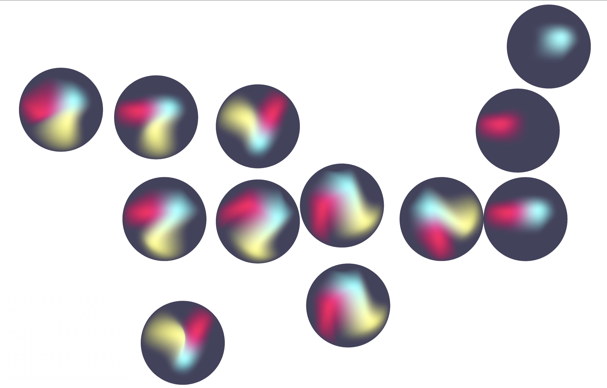

# jai
A siri-like virtual assistant animation I created for the Janssen Data Science team at Johnson &amp; Johnson

## Technical prerequisites
Before attempting to install this project on your machine, ensure you have the following things installed first
- Node

## Installation
1. Pull project down to your local machine
2. In your terminal, navigate to the root of the project directory and execute the following commands (in order):
- `npm install`
- `node server.js`
3. The last command should spit out "Example app listening on port 3000!" to your terminal (or some other port number besides 3000)
4. Open your browser and go to "localhost:3000" (or whatever port number your terminal output specified)
5. Profit

## Cool stuff thats in this project
Being that this was the only concrete requirement for the project:

*Reference picture given to me by J&amp;J designer*

I took some liberties both technically and creatively.

This app is primarily built with [Three.js](https://threejs.org/) as the means to do 3D animation.
The blobs you see in the animation are actually being rendered in real time using OpenGL (GLSL).
The animations are so smooth thanks in part to the fact that Three.js relies on the GPU to perform the visual-heavy rendering.

## Final notes
This stretch assignment was a TON of fun to make and really helped bring a lot of visibility to my work within, not just my team,
but the Software Engineering community at J&amp;J as a whole.

If you have any questions about this, don't hesitate to reach out to me at bsalgado@stevens.edu.
